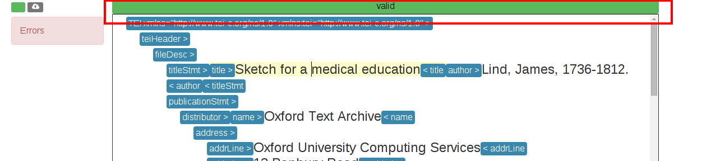
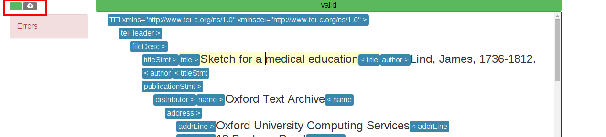
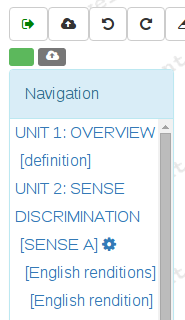
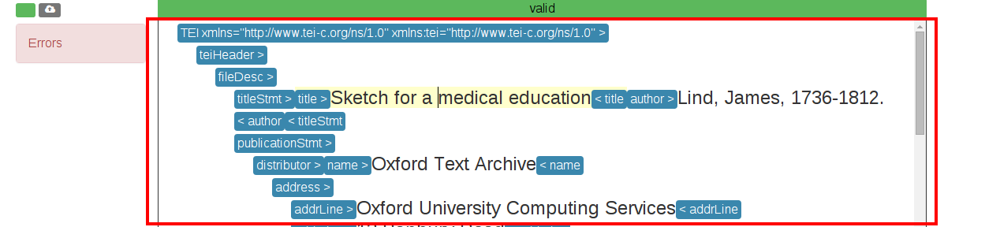
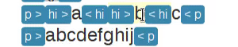
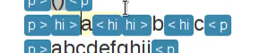
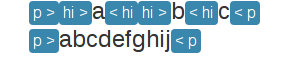
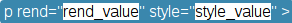
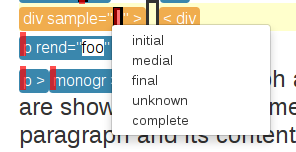
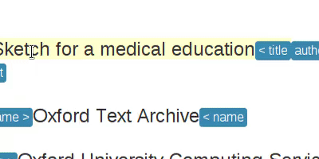

==========
Wed's Help
==========

The following help covers the basic features of wed. There are some
important caveats to keep in mind when reading this documentation.

First caveat. Wed is designed to be an XML editor that provides on the
fly validation, and *only* this. Consequently, wed has no notion of a
"document collection" and provides no means to load documents from a
collection or save documents under some name into a
collection. Functions such as these are to be provided by the larger
application in which wed is being used. **The following documentation
does not cover the functions which are outside the scope of wed.**

Second caveat. The functions of wed are exposed to the user through
*editing modes* (usually just referred to as "modes"). It is possible
to use wed with custom modes that present the document differently
from what the generic mode does, or include toolbars, menus, dialogs,
etc. **The following documentation covers only what the generic mode
(bundled with wed) provides.** Custom modes will have to provide their
own documentation.

Third caveat. Make sure that wed is supported on your browser before
`filing a bug report
<https://github.com/mangalam-research/wed/issues>`_. See `Browser
Requirements`_.

Editing Controls
================

Wed divides the screen into various areas.

The Validation Progress Bar
---------------------------

As you edit your document, wed validates your document according to
the Relax NG schema that was specified when wed was started. Whenever
you make a change to the document, wed revalidates the document.

.. note:: At the moment, wed itself does not provide a GUI to select
          different schemas. It is up to the software that uses wed to
          provide to the user the means to select a schema. How to do
          this depends on the needs of the project. For instance, wed
          is used in `BTW <https://btw.mangalamresearch.org>`_ to allow
          the editing of scholarly documents. There there can be only
          one schema in use and thus no need to ask the user to select
          a schema.

The validation progress bar is located above the editing pane. The
image below shows the general location of the bar.

         the editing pane.

   The location of the validation bar.

When an document is first loaded, or when a revalidation occurs, the
bar starts empty (all white). It is progressively filled with color as
validation proceeds. For small documents, validation will occur very
quickly and consequently the user will see the bar instantly fill to
completion. The color of the bar and the status that appears in the
center of the bar will vary depending on the results of validation.

* The bar will be green and the status will be "valid" if validation
  is complete and the document is valid.

  .. figure:: help_images/validation_bar_valid.png
     :align: center
     :alt: The validation bar is green and shows the status "valid".

     A validation bar indicating a valid document.

* The bar will be red and the status will be "invalid" if the document
  is not valid.

  .. figure:: help_images/validation_bar_invalid.png
     :align: center
     :alt: The validation bar is red and shows the status "invalid".

     A validation bar indicating an invalid document.

* The bar will be blue and the status will be "working" as long as
  validation is not complete.

  .. figure:: help_images/validation_bar_working.png
     :align: center
     :alt: The validation bar is blue and shows the status "working".

     A validation bar indicating the validation is not complete.

* There is also a "stopped" status, which you should never see.

Modification and Save Status
----------------------------

On the left side of the screen, at the top, wed shows you the
modification and save status of the document being edited.

         status, on the top left side of the screen.

   The location of the modification and save status.

The rectangle on the left is the modification status. A green
modification status indicates that the document has not been modified
since it has last been loaded or last saved. To the right of the
modification status is the save status. It starts gray to indicate
that the document has never been saved *during the current editing
session.*

.. figure:: help_images/unmodified_unsaved.png
   :align: center
   :alt: An unmodified and unsaved status.

   The status shown for a document that has not been modified since
   last loaded and has not yet been saved in this editing session.

When you modify the document, the modification status becomes orange
and contains an asterisk to indicate that the document in the editor
has modifications that have not been saved yet.

   The status shown for a document that has been modified since
   last loaded and has not yet been saved in this editing session.

When you save manually (for instance, by doing :kbd:`Ctrl-S`), the
modification status returns to green and the saved status becomes
green. The saved status also tells you how long ago the last save
occurred. Hovering on the save status brings up a tooltip telling you
what kind of save last occurred: autosave, or manual save.

.. note:: The delay between autosaves is configurable, and can be
          turned off by the application which makes use of wed. The
          availability of autosaves and the delay between autosaves
          is determined by the application which makes use of wed for
          editing.

.. figure:: help_images/unmodified_manual_save.png
   :align: center
   :alt: An unmodified and manually saved status, with tooltip.

   The status shown for a document that has been manually saved
   moments ago.

The save status will update periodically to show approximately how
long ago the document was last saved.

.. figure:: help_images/unmodified_manual_save_minutes_ago.png
   :align: center
   :alt: An unmodified and saved status, which occurred minutes ago.

   The status shown for a document that has been saved almost five
   minutes ago.

The Error Pane
--------------

On the left of the screen, under the modification and save status, you
can find the error pane. This is where XML validation errors are shown
to the user.

.. figure:: help_images/error_pane.png
   :align: center
   :alt: The location of the error pane.

   The error pane.

The error pane is collapsible. It can be collapsed or expanded by
clicking on the pane's heading. Clicking on `error markers <Error
Markers_>`_ in the editing pane will expand the error pane. Clicking on
an error description in the error pane will scroll the editing pane to
the location of the error. It will also make the error "selected". The
selected error has its description blinking in the error page and has
its error marker blinking in the editing pane.

.. figure:: help_images/click_on_error_description.gif
   :align: center
   :alt: Shows what happens when the user clicks on an error description.

   Clicking on an error description scrolls the editing pane to that
   error.

The Navigation Pane
-------------------

The navigation pane is a basic functionality of wed but will be
visible only if a mode makes use of it. **The generic mode does not
make use of the navigation pane.** The generic mode is meant to be
truly *generic* and thus does not know what elements serve as section
headings in a document. Therefore, it does not know how to build the
content of the navigation pane. So if you are using the generic mode,
you won't see it.

Custom modes that make use of the pane will show this pane under the
`modification and save status <Modification and Save Status_>`_, above
the error pane.

   The navigation pane.

The user can click on the headings in the navigation pane to quickly
scroll the editing pane to the corresponding area of the
document. Some modes may also support bringing up special contextual
menus on the headings of the navigation pane.

The Location Bar
----------------

The location bar appears right under the editing pane. It indicates
the hierarchy of elements that contain the caret. Each XML element in
the hierarchy is separated from the next by a forward slash (``/``).

.. figure:: help_images/location_bar.png
   :align: center
   :alt: Shows where the location bar is situated.

   The location bar.

In the example above, reading from the end of the location bar, the
caret is located in a ``note`` element contained by a ``notesStmt``
element contained by a ``biblFull`` element, etc.

The Editing Pane
----------------

The editing pane is where the document being edited is displayed and
where most changes to a document are performed. It appears under the
validation progress bar, above the location bar and to the right of
the error pane.

   The editing pane.

If the document is too long for the space given to wed, the editing
pane will show a scroll bar on the right that allows scrolling the
document.

We will now go over each distinctive element of the editing pane.

The Caret
~~~~~~~~~

The caret indicates where the document is being edited. It is a
blinking vertical bar. It can be moved by left clicking. When the
caret is already in the document, the arrow keys on your keyboard can
be used to move the caret.

   The caret can be moved with left clicks of the mouse or the arrow
   keys.

The element that contains the caret also acquires a pale yellow
background color while the caret is in it. Only the element which
immediately contains the caret acquires this color. The elements that
contain this element do not change background color.

Placeholders
~~~~~~~~~~~~

Empty elements contain placeholders. The placeholders are meant to
help users easily put the caret in empty elements. Without the
placeholder, the start and end labels of empty elements would be
immediately adjacent, and getting the caret between them would be more
difficult. (It would require clicking on the start label and moving
right or clicking on the end label and moving left.) When an element
is edited to contain text or other elements, it loses its
placeholder. When an element is emptied it gains a placeholder.  When
the caret is in a placeholder, the placeholder blinks to indicate that
it contains the caret.

   The ``hi`` element gains a placeholder when the text is removed,
   and loses the placeholder when text is added back.

Placeholders also appear as the value of those attributes which have
no value set.

Element Labels
~~~~~~~~~~~~~~

By default, the generic mode bundled with wed shows the start of each
XML element with a start label, and the end of each XML element with
an end label. The start and end labels can be distinguished from one
another by the fact that a start label ends with a right angle bracket
(``>``) and an end label starts with a left angle bracket (``<``).

.. note:: It is possible for custom modes to display elements using
          more specialized rendering, and omit the start and end
          labels. For instance, a custom mode could distinguish
          "paragraph" elements through line breaks and indentation,
          and omit the start and end labels of these elements.

   This figure contains a total of 8 labels: two start labels for two
   elements ``p``, and the corresponding two end labels, two start
   labels for two elements ``hi`` and the corresponding two end
   labels.

Clicking on an element's label selects the element and allows the user
to perform actions on the element as a whole. When the element is
selected, both the start and end labels are colored orange.

.. figure:: help_images/selected_labels.png
   :align: center
   :alt: An example of selected labels.

   This figure shows a ``p`` element which is selected. Its labels are
   orange.

Right-clicking on an element label will bring up a `contextual menu
<Contextual Menus_>`_ appropriate for the element. Start labels may
contain the attributes associated with the XML element to which the
label belongs. For each attribute, the label first shows the
attribute's name, followed by the equal sign (``=``) and the attribute
value in double quotes (``"``). The attribute's value appears in black
on a white background.

   This figure shows a ``p`` element with the attributes ``rend`` and
   ``style``.

.. note:: Attribute visibility is determined by the mode being used to
          edit the file, and how this mode is configured. The generic
          mode by default shows attributes. It is possible for an
          application using wed to configure the generic mode to hide
          attributes. Custom modes may be designed to hide attributes
          too.

.. note:: When a double quote appears as part of an attribute's value,
          wed will show the double quote as a double quote. In other
          words, it does not visually escape it. **However, wed does
          encode double quotes appearing in an attribute's value
          properly.**

Whenever the mode being used has provided element documentation,
hovering over a label will bring up a tooltip with the documentation
of the element.

.. figure:: help_images/label_tooltip.png
   :align: center
   :alt: An example of a start label with its tooltip open.

   This figure shows a label for a ``p`` element whose tooltip is
   open. The tooltip contains documentation on the element.

.. note:: Whether documentation is actually available depends on the
          mode being used and how the mode was configured and packaged
          with wed.

          Element documentation is not provided by wed itself. The
          generic mode used in Wed's demo is set to work with TEI
          documents, and thus provide documentations on TEI
          elements. This documentation was converted for use by wed
          but its contents was created by the authors of the TEI
          schema. Wed merely extracted it.

Label Visibility
''''''''''''''''

The editing modes of wed can be designed to assign different levels of
visibility to labels. Imagine for instance a mode that represents
breaks in paragraphs through line breaks and indentation, or foreign
text by showing it in italics, and so on. For each element that is
represented on screen using styling, it is usually not necessary to
show the end and start labels of the element: the presence of the
element and its extent is already visible through styling.

.. figure:: help_images/default_label_visibility.png
   :align: center
   :alt: A document shown at default label visibility. There is no
         element label visible in the picture.

   This is an example of the situation described above in the text.

It still may be useful sometimes for users to see the labels. Perhaps
there is an operation they want to perform that is easier to do with
labels. In such case, wed allows changing the label visibility level.

.. figure:: help_images/increased_label_visibility.png
   :align: center
   :alt: A document shown at increased label visibility. Every single
         element gets labels.

   This is an example of the same document shown earlier but with
   increased label visibility. You'll notice that the word "prasāda"
   now has start and end labels for ``foreign``. Paragraphs also have
   the ``p`` element.

Error Markers
~~~~~~~~~~~~~

Error markers indicate where in the document there is a validation
error. They appear as red rectangles at the location of the errors
they mark.

.. figure:: help_images/error_marker.png
   :align: center
   :alt: An error marker.

   An error marker appearing in an attribute value.

Clicking an error marker will expand the error pane if it was closed,
and will scroll the pane to show the error message corresponding to
the error marker. Both the marker and the error message will become
selected. Selected markers and their message blink slowly to indicate
that they are selected.

.. figure:: help_images/error_marker_click.gif
   :align: center
   :alt: Clicking an error marker.

   When an error marker is clicked, the marker and the error's
   description become selected.

Contextual Menus
~~~~~~~~~~~~~~~~

Right-clicking on element labels or in the text contained by elements
or attributes brings up a contextual menu. As the term "contextual"
suggests, the content of the menu is determined by the location where
the contextual menu is being invoked. In particular, the list of
operations available in the menu is determined by what the Relax NG
schema that governs the editing session allows in the specific
location where the menu was invoked. For instance, if an element
allows only the attributes ``a`` and ``b``, and ``b`` is already
present on the element, then the contextual menu that you get when
right-clicking on the start label of the element will show only an
option to add the ``a`` attribute, because adding a ``b`` attribute
again would not be valid.

.. figure:: help_images/contextual_menu.png
   :align: center
   :alt: A contextual menu.

   This is a contextual menu brought up on the start label of the
   ``title`` element.

The top of the contextual menu contains buttons and an input field
that allow filtering the list of options presented by the menu. When
editing a document using a complex schema, there can be dozens of
options available. Filtering helps finding the desired option
quickly.

The input field filters the options that pertain to attributes or
elements on the basis of attribute name or element name. It filters
other options on the basis of the name of the option shown in the
menu. When you bring up the contextual menu, the input field is
focused automatically, so you can type in it right away, without
having to focus it with the mouse.

.. figure:: help_images/contextual_menu_text_filter.gif
   :align: center
   :alt: Using the input field to filter entries in the contextual menu.

   The user brings up a contextual menu and filters options to those
   that contain the text ``xml``.

The buttons above the input field allow filtering the list of options
according to characteristics other than text. The buttons are divided
into two groups: the first group filters by the kind of operation
performed, the second group filters by what kind of XML construct the
operation affects. Hovering the mouse over each button will give you a
description of the filtering performed by the button. The buttons in
the first group filter as follows:

* |add| filters the list of options to those that add content. For
  instance, adding elements and attributes.

* |delete| filters the list of options to those that delete
  content. For instance, deleting elements and attributes.

* |wrap| filters the list of options to those that wrap content into
  an element. For instance, wrapping text into a new element.

* |unwrap| filters the list of options to those that unwrap
  content. For instance, unwrapping an element.

* |other| filters the list of options to those that are not in one of
  the previous categories.

.. |add| image:: help_images/filter_add.png
.. |delete| image:: help_images/filter_delete.png
.. |wrap| image:: help_images/filter_wrap.png
.. |unwrap| image:: help_images/filter_unwrap.png
.. |other| image:: help_images/filter_other.png

The buttons of the second group filter as follows:

* < filters the list of options to those that perform operations on
  XML elements. For instance, if you select this filter, then all
  options that edit attributes would be removed.

* @ filters the list of options to those that perform operations on
  XML attributes. For instance, if you select this filter, then all
  options that edit elements will be removed.

* |other| filters the list of options to those that are not in one of
  the previous categories. Therefore, it would filter the list of
  options to remove those options that perform operations on elements
  or attributes.

The first characters typed into the input field can serve to select
the buttons listed above by means of the keyboard rather than using
the mouse. When one of these keys is used to select a button, this key
only performs the task of selecting a button *but does not appear in
the input field*. The keys recognized are:

* :kbd:`+` selects |add|

* :kbd:`-` selects |delete|

* :kbd:`,` selects |wrap|

* :kbd:`.` selects |unwrap|

* :kbd:`?` selects |other| in the first group of buttons. That is, it
  filters options to those that do not add, delete, wrap or unwrap.

* :kbd:`<` selects <

* :kbd:`@` selects @

* :kbd:`!` selects |other| in the second group of buttons. That is, it
  filters options to those that do not operate on elements or
  attributes.

* :kbd:`ESC` resets filtering. It will clear all the filtering buttons
  and will clear the input field. If no filtering was in effect, then
  it will close the contextual menu.

Once a button has been selected, *either with the mouse or by using
one of the keys above*, then the keys that select filters from that
group no longer have for effect to select filters. Instead, they will
be added into the input field, just like any other key. Here are some
examples of this behavior:

* If the user opens a contextual menu and types ``+``, this will have
  for effect to select the |add| button and filter the options to
  those that add content. So far so good. Then if the user types
  ``-``, this will *not* unselect |add| to select |delete|
  instead. Rather, the ``-`` character will appear literally in the
  input field so that the end result will be that only options that
  add content and operate on attribute or elements which have ``-`` in
  their name.

* If the user opens a contextual menu and types ``+``, and then ``@``,
  the |add| and @ buttons will be selected and the list will show only
  those options that add attributes. After the user types ``+``, the
  keys associated with the first group of buttons cease to select
  buttons, but those associated with the second group continue to be
  available to select one of the buttons in the second group. Once
  ``@`` has been typed too, then none of the keys that select buttons
  perform button selections anymore.

Resetting filtering by typing :kbd:`ESC` resets this behavior. In
other words, the keys that select buttons become operational
again.

It is possible to select an option from the contextual menu by using
the up and down arrow keys on the keyboard and typing :kbd:`ENTER` on
the desired option. :kbd:`ESC` closes the contextual menu without
performing a selection, provided there is no filtering in effect,
otherwise it will clear the filtering. If filtering is in effect, then
using :kbd:`ESC` twice in a row will close the contextual menu.

Completion Menus
~~~~~~~~~~~~~~~~

If the schema used to edit the document specifies an enumerated list
of possible values, wed will present the user with a completion
menu. A common case is for attributes that may take only a limited set
of values. Upon first placing the caret in a location that can be
auto-completed, wed will present the whole list of possible values.

   The user just clicked into the ``sample`` attribute. Wed presents
   the list of possible values.

The user may use the arrows on the keyboard to go up and down the list
of values to highlight a value, and hit :kbd:`ENTER` to insert it as
the attribute value. Note that hitting :kbd:`ENTER` when no value is
highlighted in the menu will insert the first value in the menu. Or
the user may start typing a value at the keyboard. As a value is
entered, the list of completions will be narrowed to those values that
begin with the characters entered by the user. The matched prefix will
be bolded in the list of values. The user may then use the keyboard
arrows and :kbd:`ENTER` to complete the value already begun. It is
possible also to just type the whole value at the keyboard (which may
be faster, in some cases, than fiddling with a menu), in which case
the menu will close once the value is complete.

.. figure:: help_images/completion_typing.gif
   :align: center
   :alt: A completion menu as the user types in.

   The user types ``med`` into the completion menu and then hits
   :kbd:`ENTER` to complete the value.

Kinds of XML Operations
=======================

Wed divides operations on elements and attributes into a few categories:

* Adding. Such operations are usually marked with the |add|
  symbol. These are operations that add entirely new elements or
  attributes to the document. They normally do not operate on
  selections.

   The user adds an ``abbr`` element to the document.

* Deleting. Such operations are usually marked with the |delete|
  symbol. These are operations that remove whole elements or
  attributes from the document. They normally do not operate on
  selections.

.. figure:: help_images/deleting.gif
   :align: center
   :alt: A user deletes an element.

   The user deletes an ``abbr`` element from the document.

* Wrapping. Such operations are usually marked with the |wrap|
  symbol. These operations add an element around a section of the
  document being edited. The section is indicated by clicking and
  dragging with the mouse to select a part of the document. Therefore,
  wrapping operations appear in the contextual menu only if a
  selection is in effect. They "wrap" the selection in a new element.

.. figure:: help_images/wrapping.gif
   :align: center
   :alt: A user wraps an element.

   The user wraps text in an ``abbr`` element.

* Unwrapping. Such operations are usually marked with the |unwrap|
  symbol. This is the reverse of wrapping. These operations operate on
  an element so as to remove the element but put the element's
  original content in place of the element being removed. They
  normally do not operate on selections.

.. figure:: help_images/unwrapping.gif
   :align: center
   :alt: A user unwraps the content of an element.

   The user unwraps the content of an element.

Saving
======

You can save by using :kbd:`Ctrl-S` or whatever means provided by the
application that uses wed. Possible outcomes:

* The data is saved. You will see a message telling you that the data
  was saved, and the `save status <Modification and Save Status>`_
  will indicate the data was saved.

  .. figure:: help_images/saved_message.png
     :align: center
     :alt: A green message saying "Saved".

     This is the message that a user gets when a document was saved.

* Wed is disconnected from the server. You will get a dialog box
  saying:

   It appears your browser is disconnected from the server.  Editing
   is frozen until the connection is reestablished.  Dismissing this
   dialog will retry saving. If the operation is successful, you'll be
   able to continue editing. If not, this message will reappear.

  You're effectively prevented from further edits until wed is able to
  reestablish connectivity with the server.

  .. note:: It is possible to configure wed to use other types of
            saving mechanisms than sending data to a server. For
            instance, ``localStorage`` can be used to record data in
            the browser itself. What mechanism wed uses depends on how
            the application in which wed is used has configured wed.

* The server responded to the save request with a message that
  indicated that the document being edited with wed changed on the
  server. In other words, while you were editing a document someone
  else edited and saved the same document, or an automated process
  modified the document. You'll get a dialog box with the following
  message:

   Your document was edited by someone else since you last loaded or
   saved it. You must reload it before trying to edit further.

  On reload, wed will acquire a fresh copy of the document from the
  server. **The edits you performed on your document will be lost.**
  Wed is not currently equipped to deal with concurrent modifications
  from multiple sources.

  .. note:: This is another instance where application that makes use
            of wed is the party responsible for providing the means to
            resolve concurrent modification conflicts or prevent them
            from happening in the first place.

            The solution is really application-specific. For `BTW`_ we
            decided that locking documents to prevent concurrent
            modifications was the right solution. Another project
            could conceivably decide to solve conflicts in a way
            similar to what ``git`` does for merge conflicts. There's
            no single answer here.

* There is an application-specific error which prevents saving the
  data. You will see a message in a red notification bubble telling
  you what error happened, and the `save status <Modification and Save
  Status>`_ will not be updated. The content of the error message
  depends on the specific nature of the error. For instance, an
  application which requires that documents be given titles before
  they are saved could report an error if you try to save a document
  without a title.

Cut, Copy and Paste
===================

Wed allows cutting, copying and pasting parts of a document. However,
because it edits XML, there are some limitations to what you can do:

* Cutting will work only if the selection being cut starts and ends
  inside the same XML element. The selection can span over XML
  elements, provided that it completely contains these elements.

  .. figure:: help_images/invalid_selection_cut.png
     :align: center
     :alt: A selection which cannot be cut.

     This selection cannot be cut from the document because it begins
     in one ``p`` element but ends in the subsequent ``p`` element.

  .. figure:: help_images/valid_selection_cut.png
     :align: center
     :alt: A selection which can be cut.

     This selection can be cut from the document because it begins and
     ends in the same ``p`` element. There is a ``lb`` element inside
     the selection, which is fine.

  A selection that cannot be cut can still be copied.

  .. warning:: Browsers put significant obstacles into the path of any
               JavaScript code that wants to handle cutting
               itself. (It is a security issue.) Consequently, it is
               possible that cutting won't work on your platform. Wed
               *cannot* verify that cutting *will* work on your
               platform and cannot for now *reliably* issue warnings
               about problems. So... it is possible that if you try to
               cut, the selected data will be deleted from the editing
               screen but will **not** be copied into the clipboard.

* Pasting does not allow the creation of an invalid document. Suppose
  you select a region of the document that cannot be cut because it
  violates the rule mentioned above. However, this selection can be
  copied so you copy it. Then you go elsewhere in the document and try
  to paste it. You will get a dialog box saying:

    The data you are trying to paste appears to be XML. However,
    pasting it here will result in a structurally invalid document. Do
    you want to paste it as text instead? (If you answer negatively,
    the data won't be pasted at all.)

  If you answer ``No`` then copy operation will be canceled. If you
  answer ``Yes`` then the selection will be converted to text and then
  the text will be pasted.

Undo and Redo
=============

Wed maintains a list of the operations that have been performed on the
document being edited. This list is created anew with each editing
session. In other words, each time you open a document with wed, it
creates a new list. You can use :kbd:`Ctrl-Z` to undo the last
operation. Undoing again, will undo the operation before the last one,
etc. You can undo as many editing operations as you want, up to the
start of the undo list. Conversely, :kbd:`Ctrl-Y` will redo the
operation that was just undone. It is useful in cases where you've
undone more than you meant to.

Keyboard Shortcuts
==================

"Shortcut" is a bit of a misnomer, since some of the functions
mentioned here are available only through the keyboard when using a
minimal configuration of wed (i.e. using the generic mode), but we'll
stick with it.

===============     =====================================
 Key                 Function
===============     =====================================
 :kbd:`F1`           Bring up the help.
 :kbd:`Ctrl-/`       Bring up the `contextual menu <Contextual Menus_>`_.
 :kbd:`Ctrl-[`       Decrease the `label visibility level <Label Visibility_>`_.
 :kbd:`Ctrl-]`       Increase the `label visibility level <Label Visibility_>`_.
 :kbd:`Ctrl-Z`       `Undo <Undo and Redo_>`_ an operation.
 :kbd:`Ctrl-Y`       `Redo <Undo and Redo_>`_ an operation.
 :kbd:`Ctrl-X`       `Cut <Cut, Copy and Paste_>`_ content.
 :kbd:`Ctrl-C`       `Copy <Cut, Copy and Paste_>`_ content.
 :kbd:`Ctrl-V`       `Paste <Cut, Copy and Paste_>`_ content.
 :kbd:`Ctrl-S`       `Save <Saving_>`_ content.
===============     =====================================

Note that in browsers running in OS X, instead of :kbd:`Ctrl-` wed
expects :kbd:`Command-`.

.. _help_browser_requirements:

Browser Requirements
====================

Wed is primarily developed using a recent version of Chrome (version
47 now, earlier versions have also been used earlier). (But see a note
about Chrome 34 below.)

Here is the list of officially supported browsers, in order of
decreasing priority. The higher a browser is in the list, the less
likely you are to run into issues and the higher the priority for
resolving bugs happening with this browser.

* Chrome 47 and higher.

* IE 11.

* Edge, but see `the section about it <Edge_>`_.

* Relatively recent versions of Chrome: older than the latest releases
  but not very old. (Yeah, this is vague. Sorry about that.)

File an issue on github if you find a problem with one of the
supported browsers above.

We would like to support phone and tablet browsers but due to a lack
of development resources, such support is unlikely to materialize
soon. In decreasing order of likelihood, the following cases are
unlikely to ever be supported:

* Versions of Chrome older than those mentioned above.

* Firefox. It deserves its own `discussion <Firefox_>`_.

* IE 10. Wed used to be routinely tested on IE 10, but Microsoft no
  longer supports it. It is very unlikely that we'd resume support for
  IE 10. We'd need a) a substantial demand for it and b) people
  willing to participate in providing support.

* IE 9. Same caveats as IE 10 above. Moreover, as time goes by, wed is
  accumulating features that are not supported natively in IE 9, so
  the possibility of supporting IE 9 is becoming more and more remote.

* Chrome 34: the luminaries at Google decided to remove
  ``Attr.ownerElement`` from Chrome 34. It was reintroduced in
  Chrome 35. We'll probably never have support for Chrome 34.

* Antique browsers.

* Oddball browsers or other software or hardware systems that present
  web pages. (E.g. gaming consoles, smart TVs.)

* Operating systems or browsers no longer supported by their own
  vendors.

Firefox
-------

We're hoping that the lack of Firefox support is going to be
temporary. For years, wed was supporting Firefox. Early on, Firefox
was even better supported than Chrome. However, the people responsible
for maintaining Selenium decided to stop supporting native events in
Firefox and forced developers to use synthetic events instead. The
problem is that Selenium's support for synthetic events on Firefox is
unable to accurately reproduce what happens when a user is actually
interacting with a browser, *which is the entire point of using
Selenium in the first place*. The problem has been reported, at
length:

* In the `selenium-developers` group `here
  <https://groups.google.com/d/msg/selenium-developers/DKnG2lA-KxM/EMLiT87ykZYJ>`__ and in following replies.

* And these unresolved bugs `here
  <https://github.com/SeleniumHQ/selenium/issues/825>`__, and `here
  <https://github.com/SeleniumHQ/selenium/issues/1463>`__.

* And these resolved bugs `here
  <https://github.com/SeleniumHQ/selenium/issues/862>`__ and `here
  <https://github.com/SeleniumHQ/selenium/issues/813>`__.

It is taking forever for the problem to get resolved. In the meantime,
we have no resources to devote to solving the issue of synthetic event
support in Firefox and so Firefox support has been temporarily pulled.

Edge
----

What's the deal with Edge being at a lower level of support than IE
11? The problem is that whereas we can run test suites for IE 11, it
is not *yet* possible to do so for Edge. Microsoft has not yet
released a version of Edge which does support everything needed to run
our suite. (See `this page
<https://dev.windows.com/en-us/microsoft-edge/platform/status/webdriver/details/>`__
for the technical details.) Therefore we cannot systematically test
wed with Edge and thus it is not as supported as IE 11. If you do find
a problem with Edge, report it and we'll try to fix it.

OS X
----

.. warning:: If you are using any version of OS X that hides
             scroll bars by default, you probably want to modify your
             OS X settings so that scroll bars are always
             shown. Otherwise, there are situations where you won't
             know about contents being scrollable. If you need help
             doing so, `see this blog post
             <http://heresthethingblog.com/2013/02/25/mac-tip-missing-scroll-bars/>`__. Note
             that wed will work either way, and you will be able to
             scroll either way, but wed relies on the traditional
             scroll bar behavior to indicate that something can be
             scrolled. So if you do not make the change above, you can
             end up in situations where something is scrollable
             without having any visual indication that *it is*.

The test suite depends on native events to do its work, but support
for native events in OS X is spotty:

* Chrome: it is possible to generate *some* native events.

* Firefox reports that it does not support native events at all.

* Safari does not support native events at all.

Your best bet in OS X is to use Chrome because we can't run the test
suite with Firefox or Safari.

Safari
------

Safari is a vexing case. Wed may or may not work on Safari. We
currently cannot run the automated test suite with Safari. Manual
testing is out of the question.

We would like to have wed be supported on recent versions of Safari to
the same extent it is supported on recent versions of Chrome. The tool
we use to test it is Selenium. For better or for worse this is the
go-to tool to do the kind of test wed needs. We've not seen evidence
of any collaboration between the Selenium project and Apple. Thus
testing support for Safari is deficient, and it is not something that
we here have the resources to fix.

If you desire that wed be actually tested on Safari and are in a
position to contribute substantial monetary or technical resources
towards this goal, you are welcome to contact us. In particular,
immediate problem we've run into when trying to test on Safari is this
`Selenium issue
<http://code.google.com/p/selenium/issues/detail?id=4136>`__. If you
want fix it, then this would bring us one step closer to being able to
test wed on Safari. And regarding the state of Selenium support for
Safari, take note this response from a Selenium project member:

 Safari is not a priority, sorry. But your patches are welcome!

Absent these patches, wed is unlikely to support Safari.

On the other hand, if you feel the urge to write an email saying "You
should just...", then please abstain because there is nothing "just"
about testing web applications.

..  LocalWords:  toolbars NG Ctrl tooltip autosave autosaves biblFull
..  LocalWords:  notesStmt TEI xml kbd ESC localStorage github Attr
..  LocalWords:  ownerElement
